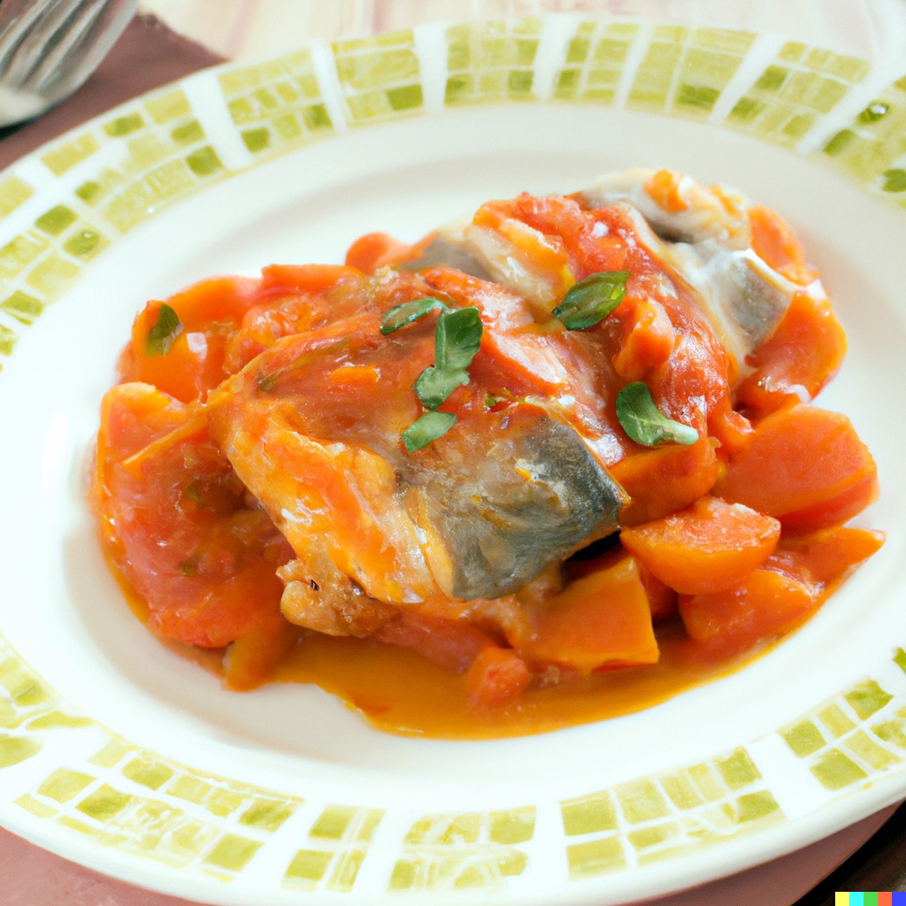

# Moje dane
Imię: Kacper \
Nazwisko: Góra\
Pseudonim: Kapi\
Status: Student AGH w Krakowie na kierunku Cyberbezpieczeństwo

## Przepis na rybę po grecku, którą bardzo lubię (Rzetelnie Polecam)

Składniki:

    1 kg filetów z ryby
    1/2 szklanki oliwy z oliwek
    1 cytryna
    2 ząbki czosnku
    1 łyżka posiekanej natki pietruszki
    sól i pieprz do smaku

Przygotowanie:

    Przygotuj rybę - umyj i osusz filety.
    W misce wymieszaj oliwę z oliwek, sok z cytryny, posiekany czosnek, natkę pietruszki, sól i pieprz.
    Umieść rybę w naczyniu żaroodpornym i zalej przygotowanym sosem.
    Piecz w piekarniku nagrzanym do 180 stopni przez około 25-30 minut.

### Fotka

